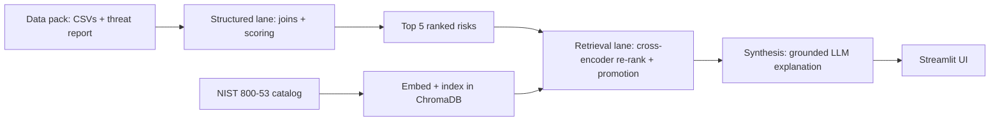

# TawasolPay AI Cyber Risk Assistant

**Live app: [cyber-risk-assistant-12345.streamlit.app](https://cyber-risk-assistant-12345.streamlit.app/)**
(free-tier Streamlit Cloud sleeps after inactivity — the first open may take a few seconds
to wake up)

A system that takes TawasolPay's asset, vulnerability, threat intelligence, and business
context, and produces a prioritized top-5 risk report with remediation guidance retrieved
live from the real NIST SP 800-53 control catalog.

## What it does

Given the data pack (60 assets, 114 open vulnerabilities, 40 threat intel records, business
service context, and this week's MDR threat advisory), the system ranks the five risks that
matter most — weighted by internet exposure, active exploitation, ransomware association,
business criticality, and missing compensating controls, not CVSS score alone. For each of
the five, the output includes the asset, the vulnerability, the matched threat intel (if
any), the business service at risk, and a plain-English sentence explaining why it ranks
where it does — then retrieves the most relevant NIST 800-53 control by semantic search over
the real control catalog and generates a short, grounded remediation explanation.

`remediation_guidance.csv`'s one-line hints are deliberately never read by the system —
every remediation explanation is grounded in the retrieved NIST control text, not that file
and not the LLM's own training data.

## Architecture

Two independent lanes feed a single synthesis step:

- **Structured lane** (`src/data_loader.py`, `src/scoring.py`) — plain pandas joins across
  the data pack, and a deterministic, weighted risk score. No LLM involvement, so the
  ranking is reproducible: the same data always produces the same top 5.
- **Retrieval lane** (`src/nist_ingest.py`, `src/retrieval.py`) — the NIST 800-53 catalog
  (1,567 chunks) embedded locally with `sentence-transformers` and searched via ChromaDB.
  A cross-encoder re-ranks the initial candidates, and a small set of structural rules
  (base-control promotion, related-control backfill) refine the result. Nothing here is
  hardcoded — every control shown is genuinely retrieved, not looked up from a fixed table.
- **Synthesis** (`src/synthesis.py`) — the only place an LLM is called. It receives
  pre-computed facts and pre-retrieved control text, and its job is limited to writing two
  grounded paragraphs around them — it never decides the ranking and never invents a
  control.



## Data sources

The five data-pack CSVs and the threat report are provided as-is. Two additional real,
authoritative public documents were retrieved rather than pre-loaded, per the assignment:

- **CISA Known Exploited Vulnerabilities (KEV) Catalog** — retrieved from
  [github.com/cisagov/kev-data](https://github.com/cisagov/kev-data), saved locally as
  `data/known_exploited_vulnerabilities.csv`. Used only as an additive confirmation signal
  (see Supporting Question 2, finding 1) — never a gate on "actively exploited."
- **NIST SP 800-53 Rev. 5 Security Control Catalog** — retrieved from
  [csrc.nist.gov/projects/risk-management/sp800-53-controls/downloads](https://csrc.nist.gov/projects/risk-management/sp800-53-controls/downloads),
  converted to `data/NIST_SP-800-53_rev5_catalog_load.csv` and embedded (see Architecture
  above, and Supporting Question 1 below) — the only source the system ever cites for
  remediation guidance.

## Setup

```bash
git clone https://github.com/premsagariit/Cyber_Risk_Assistant.git
cd tawasolpay-risk-assistant

python -m venv .venv
source .venv/bin/activate

pip install -r requirements.txt

cp .env.example .env
# edit .env and add your LLM_API_KEY (see .env.example for provider options - I have used the Gemini API Key)

# One-time: builds the NIST vector store (~1,567 chunks, downloads the embedding and cross-encoder models on first run)
python scripts/build_vector_store.py

streamlit run app.py
```

The app works with any OpenAI-compatible LLM provider — Groq, OpenRouter, or Gemini — by changing `LLM_API_KEY`, `LLM_BASE_URL`, and `LLM_MODEL` in `.env`. It currently runs on Gemini 3.1 Flash-Lite by default.

## Running the tests

```bash
pytest tests/
```

| File | What it checks |
|---|---|
| `test_scoring.py` | The risk-scoring formula in isolation, including the case the assignment itself describes: a lower-CVSS, internet-exposed, actively-exploited finding outranking a higher-CVSS internal one |
| `test_ranking_ground_truth.py` | The full structured lane end to end against the real data pack, checked against a known-correct top 5 |
| `test_synthesis_grounding.py` | The LLM's output stays anchored to the facts it was given (right CVE, right control, no invented campaign matches) |
| `test_retrieval_real_findings.py` | The retrieval pipeline against the real top-5 findings from the data pack — not just the synthetic benchmark cases (see Supporting Question 2) |

For retrieval quality specifically:

```bash
python eval/nist_retrieval_eval.py
```

This benchmarks 10 hand-labeled cases against the retrieval pipeline and reports hit@1 /
hit@3. Current result: **hit@1: 7/10, hit@3: 8/10** — up from a 10%/40% naive baseline,
after fixing an embedding-chunking bug that was silently truncating long controls.

## Deployment

Deployed on Streamlit Community Cloud — see the live link at the top of this README. The app
is self-contained aside from the LLM API key, which is set as a Streamlit secret
(`LLM_API_KEY`) rather than committed to the repo.

## Supporting Question 1 — the data split

**What we embedded, and why:** only the NIST SP 800-53 control catalog — 1,567 chunks of
formal control text. The right control for a given finding is a semantic match against prose
we don't already have a lookup key for, which is exactly the problem embeddings solve.

**What we queried as structured records, and why:** everything else — the five data-pack
CSVs, the real CISA KEV catalog, and the one-page threat report. All of it is small and
exactly joinable on keys we already control (`asset_id`, `cve`, `business_service`), and the
ranking needs to be deterministic and reproducible — the same input always produces the same
top 5 — which embedding-based retrieval would work against.

## Supporting Question 2 — where it goes wrong

1. **Synthetic CVE identifiers never match the real CISA KEV catalog.** Every `CVE-SYN-*`
   identifier in this exercise is fictional and will never appear in the real, government-
   maintained KEV feed. A system that gated "actively exploited" purely on a KEV lookup would
   silently under-rank several of the highest-impact findings in this dataset. We treat the
   scenario's own threat intelligence as the primary exploitation signal, and use a real KEV
   match only as an additive confirmation, never a gate.
2. **A working test can exist and still never run.** `test_synthesis_grounding.py` was
   written specifically to catch ungrounded LLM output, but it silently skipped for weeks
   because it checked an environment variable that only the app's own startup code loaded
   from `.env`. In that window, a token-budget misconfiguration caused several real risk
   cases to render with a blank explanation and no error — exactly the failure the test was
   built to catch, undetected because the test never actually executed. Fixed by loading the
   environment the same way at both call sites, and verified by tracing every real output,
   not just checking whether pytest reported green.
3. **A cross-encoder re-ranker can be confidently wrong, not just imprecise.** After adding
   re-ranking to improve retrieval precision, one real finding (a session-token leak
   vulnerability) began citing NIST control PE-19 — a physical security control about
   electromagnetic signal emanation, unrelated to the actual vulnerability, matched only
   because both mention "leak." This shipped undetected for several rounds because the
   automated retrieval benchmark only covered synthetic test cases, never the real findings
   from the data pack. Fixed by enriching the retrieval query with a real fact already present
   in the threat intelligence data, and by adding a permanent test that runs retrieval against
   the real top-5 findings, not only the synthetic benchmark.

## Supporting Question 3 — one thing to improve with another day

Build regression coverage around the real data pack's actual findings from day one, not only
the synthetic benchmark cases. Every retrieval-quality bug that shipped past initial testing
in this project — including the PE-19 mismatch above — did so specifically because the only
automated check ran against hand-labeled synthetic cases. The fix that mattered most wasn't
any single retrieval change; it was making the real production output a permanent part of
the test suite, so the next change to this pipeline can't silently regress it again.
